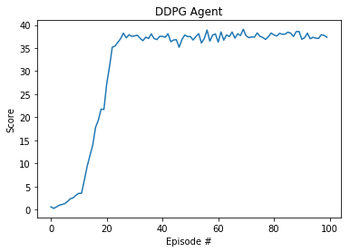

# Continuous Control Report

### Algorithm

The solution for this project closely follows the original DDPG algorithm laid out in the [original DDPG paper](https://arxiv.org/pdf/1509.02971.pdf).

The algorithm uses an 'actor' to determine the best action and a 'critic' to estimate the value-function for that action. These were trained using an Adam optimization function.

For both the actor and critic, the algorithm makes use of 2 networks, one online and one target. The target network is used while training to provide stability. The target is updated using a soft update strategy parameterized by tau.

While interacting with the environment, Ornstein-Uhlenbeck noise is added to the action space. Experience tuples are stored in an experience replay buffer, and a random batch are sampled to train the actor and critic networks.

#### Network Setup

The actor network used three linear nodes:
- input node: fully connected node with 33 inputs and 400 outputs
- hidden node: fully connected node with 400 inputs and 300 outputs
- output node: fully connected node with 300 inputs and 4 outputs

The critic network used a single node at the head with 33 inputs and 400 output. This output was concatenated with the action inputs of size 4 and fed into a fully connected node with 404 inputs and 300 outputs. The final node was another fully connected layer of 300 inputs and 1 output.

The input and hidden nodes used a ReLU activation function and the output node on the actor used a tanh activation function and the critic used a linear activation function.

#### Hyperparameters

The hyperparameters used by the agent were the following:
- Batch size: 512
- Actor Learning Rate: 0.0001
- Critic Learning Rate: 0.0003
- Tau: 0.001
- Gamma: 0.99
- Replay Buffer Size: 1e6

To train the agent, a max timestep of 1000 was used per episode.

The algorithm makes use of Ornstein-Uhlenbeck noise with the following settings:
- mu: 0
- theta: 0.15
- sigma: 0.2

### Results

When run with the hyperparameters listed above, the agent achieved an score of 30 averaged over all agents in **22** episodes. Though the agent was achieved an average of 30 over all episodes in **85** episodes. Due to the project requirements of the average being over the last 100 episodes, the official solution is at episode **100** where we get a mean score of 31.21.

The agent took 70 minutes to train.



```
Episode 10	Current Score: 3.13	Average Score: 1.47
Episode 20	Current Score: 21.69	Average Score: 7.19
Episode 30	Current Score: 37.52	Average Score: 16.56
Episode 40	Current Score: 37.52	Average Score: 21.74
Episode 50	Current Score: 37.48	Average Score: 24.80
Episode 60	Current Score: 38.06	Average Score: 26.90
Episode 70	Current Score: 39.07	Average Score: 28.45
Episode 80	Current Score: 38.25	Average Score: 29.58
Episode 90	Current Score: 38.58	Average Score: 30.53
Episode 100	Current Score: 37.34	Average Score: 31.21
```

#### Attempts and Learning

At the outset of the project, an attempt was made to use the PPO exercise code to train the agents. The results were dismal. Determining why was a struggle as the course materials covering PPO differed heavily from other implementation examples for PPO (like [here](https://github.com/openai/baselines/tree/master/baselines/ppo1) and [here](https://github.com/ShangtongZhang/DeepRL)), most notably around the use of a critic to calculate a value function. After reading the paper and multiple attempts to implement it in toy environments, learning and mastering PPO was determined to be a long-term project and moved to the back burner.

Since DDPG is a familiar algorithm and fits the environment requirements, a standard DDPG agent was used to train the single articulated arm case. Despite rigorous hyperparameter tuning, the agent did not train well, taking over 2500 episodes to achieve a score of 30+ and over 10+ hours on the clock. It was also noticed that the rewards returned maxed out at 0.04.

The multiple agent case was attempted in the hopes that the reward cap was a bug. At first, the algorithm was adapted in a few lines of code to process all states and actions at once using a single agent.

Surprisingly, this seemed to work quite well as the agent trained much faster and achieved an average score of 30+ quickly. Intuitively, the mechanism would be similar to how using Experience Replay improves results. The correlation between states and next states would be broken by .

An attempt to have parallelized agents using a single ER buffer was made, but the training speed was similar to the single agent case. It was unclear whether this was due to programming error or a true result. After a few hours of investigation, this approach was dropped since the single agent's results were more than sufficient and the above intuition seemed to explain it.

Batch normalization was attempted, but it didn't improve the agent's training very much and resulted in a slower wall clock time to train per episode.

Gradient clipping for the critic was attempted as well, but the average rewards collapsed around the 80th episode when this was enabled with the tuned hyperparameters.

#### Trained Agent Replay


### Future Work

#### Algorithm Improvements

Improving upon the DDPG algorithm is an area of active research, so there are a number of improvements available.

Here are some planned improvements for future iterations of DDPG:
- [Prioritized Experience Replay](https://arxiv.org/abs/1511.05952)
- [Parameter Noise](https://blog.openai.com/better-exploration-with-parameter-noise/)

#### Other Algorithms

Though it wasn't needed to solve this environment, the Distributed [Distributional Deterministic Policy Gradients](https://openreview.net/pdf?id=SyZipzbCb) algorithm looks promising for other parallel environments.

PPO is another algorithm worth retrying in this environment. Future work would be comparing the results between the two algorithms.
